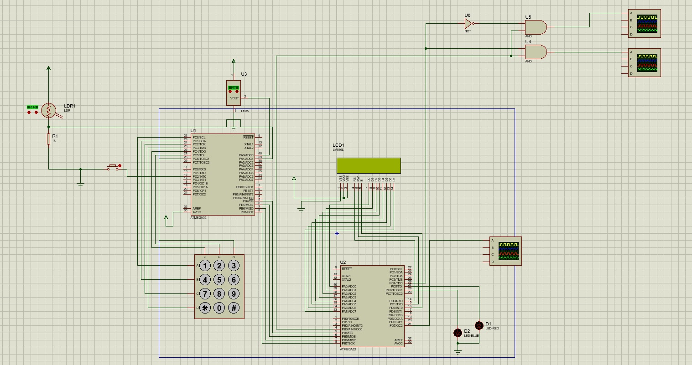

# CPS-AVR
This is AVR project of Micro Processor course.

# Smart Home CPS Project

## Introduction
In this project, we designed a simple Cyber-Physical System (CPS) using the Atmega32 microcontroller. The project consists of three main parts: Security, Temperature Control, and Lighting Control. The system utilizes embedded systems and cyber-physical systems principles to create a smart home environment.

## Summary
This project aims to implement a smart home system using Atmega32 microcontrollers. The system incorporates various features such as security, temperature control, and lighting control. It utilizes a keypad for password input, an LCD screen for displaying messages, and sensors for monitoring temperature and lighting conditions. The system employs timers and PWM to control motors and LEDs based on the sensed data. Additionally, a bonus feature includes a speaker for generating sound alerts. The implemented system successfully addresses the objectives of the project and serves as a foundation for further enhancements and expansions.

## Parts of the Project
The project is divided into three main parts:

### Part 1: Security
The security part involves password checking, submitting the password, deleting characters, and toggling the password display. User input is provided through a keypad, and messages are displayed on an LCD screen.

### Part 2: Temperature Control
The temperature control part includes reading data from the LM35 temperature sensor and taking appropriate actions based on the temperature readings. The system adjusts the duty cycle of motors and controls LEDs to indicate the temperature range.

### Part 3: Lighting Control
The lighting control component utilizes an LDR sensor to monitor lighting conditions in the environment. The system adjusts the duty cycle of a motor to control the lighting intensity based on the LDR readings.

## Getting Started
To get started with the project, follow these steps:

1. Set up the hardware components as per the circuit diagram provided.
2. Upload the respective code to the Atmega32 microcontrollers.
3. Connect the microcontrollers using the SPI interface.
4. Power on the system and interact with the keypad for password input and control the temperature and lighting.

